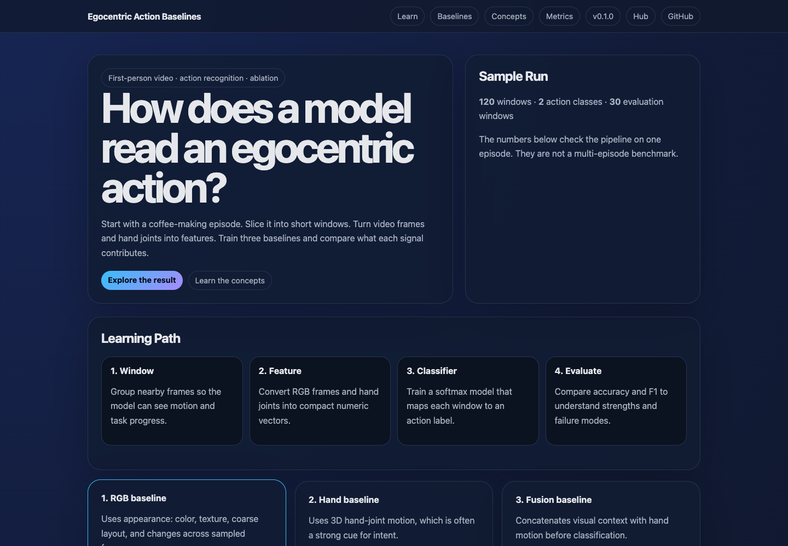

# Egocentric Action Baselines

[](https://github.com/ChaoYue0307/egocentric-action-baselines/actions/workflows/ci.yml)

Learn how first-person action recognition works by comparing three small,
inspectable baselines on one Xperience-10M pour-over coffee episode.

Part of the Egocentric Vision Learning Hub:
https://chaoyue0307.github.io/egocentric-vision-learning-hub/

The task is simple to state: given a short temporal window from an egocentric
video, predict what action is happening. The repo shows how RGB appearance,
hand-joint motion, and early sensor fusion each contribute to that prediction.




## Interactive Tutorial

Open the visual walkthrough:

- Web page: https://chaoyue0307.github.io/egocentric-action-baselines/
- Local copy: open `docs/index.html` in a browser.

The page includes a learning path, metric selector, ablation chart, visual
concept explanations, and result interpretation cards.

## What You Will Learn

- **Egocentric action recognition:** classifying actions from the camera wearer's point of view.
- **Temporal windows:** grouping nearby frames so the model sees motion, not only one image.
- **RGB baseline:** using image color, texture, and coarse layout features.
- **Hand-joint baseline:** using 3D hand pose and motion as an action cue.
- **Fusion baseline:** concatenating RGB and hand features before classification.
- **Ablation study:** changing one input source at a time to see what matters.
- **Accuracy and F1:** reading both overall correctness and class-balanced performance.

## Data

Raw Xperience-10M videos, `annotation.hdf5`, and `.rrd` files stay outside this repository.
Set `DATA_ROOT` to your local sample directory:

```bash
export DATA_ROOT=/path/to/xperience-10m-sample
```

The expected directory contains `annotation.hdf5` and `fisheye_cam0.mp4`.
See `DATA_NOTICE.md`, `DATA_CARD.md`, and `EVALUATION_CARD.md` for the data contract, intended use, metrics, and limitations.

## Run The Baselines

```bash
python3 -m venv .venv
source .venv/bin/activate
pip install -r requirements.txt

python scripts/run_ablation.py \
  --data-root "$DATA_ROOT" \
  --output-dir outputs/sample_ablation \
  --split-strategy chronological \
  --max-windows 240
```

Use `--max-windows 0` to run all labeled windows.
The default `chronological` split keeps the last portion of the timeline for
evaluation, which reduces leakage from overlapping windows.

After installing the project, the same command is available as:

```bash
pip install -e .
ego-action-ablation --data-root "$DATA_ROOT" --output-dir outputs/sample_ablation
```

To compare the NumPy softmax head with the optional PyTorch MLP head:

```bash
pip install -e ".[mlp]"
ego-action-ablation --data-root "$DATA_ROOT" --model both --epochs 300
```

To run a stronger multi-episode check when you have more samples:

```bash
ego-action-ablation \
  --data-roots /path/to/sample_a /path/to/sample_b \
  --model all \
  --output-dir outputs/multi_episode_eval
```

## Repository Map

| Path | Purpose |
| --- | --- |
| `scripts/run_ablation.py` | command-line entry point for RGB, hand, and fusion experiments |
| `src/ego_action_baselines.py` | dataset loading, feature extraction, training, and metrics |
| `src/adapters.py` | source boundary for video frames, hand poses, and labels |
| `notebooks/01_action_baseline_walkthrough.ipynb` | step-by-step notebook companion |
| `reports/action_baseline_report.md` | paper-style method, result, and limitation summary |
| `docs/index.html` | interactive tutorial webpage |
| `docs/concepts.md` | glossary for CV/ML terms |
| `outputs/sample_ablation/summary.json` | compact example result |

## Common Commands

```bash
make test
make help
make visuals
make pages
```

## Baselines

| Experiment | Signal | What It Tests |
| --- | --- | --- |
| `rgb_only` | sampled frames from `fisheye_cam0.mp4` | Can appearance and scene layout identify the action? |
| `hand_joints_only` | left/right 3D hand joints from `annotation.hdf5` | Is hand motion enough to infer intent? |
| `rgb_hand_fusion` | RGB + hand features | Does combining visual context with hand motion help? |
| `*_majority` | no visual or hand features | Does the classifier beat the class-prior baseline? |
| `*_mlp` | same features with a small PyTorch MLP head | Does a nonlinear classifier improve the chronological split? |

Sample result from a short run:

| Experiment | Accuracy | Macro F1 | Feature Dim |
| --- | ---: | ---: | ---: |
| `rgb_only` | 0.700 | 0.824 | 686 |
| `hand_joints_only` | 0.167 | 0.286 | 882 |
| `rgb_hand_fusion` | 0.067 | 0.125 | 1568 |

Each run writes `summary.json` plus per-experiment `metrics.json`,
`per_class_metrics.csv`, `confusion_matrix.csv`, `predictions.csv`, and
`model.npz`.
Batch runs also write `aggregate_summary.json` with mean and standard deviation
across episode roots.

## How To Read The Result

High scores on one episode mean the feature extraction, label alignment, and
evaluation loop are working. They do not prove cross-episode generalization.
For a stronger benchmark, add many episodes and split by held-out episode so the
test set contains unseen kitchens, camera motion, and action styles.
